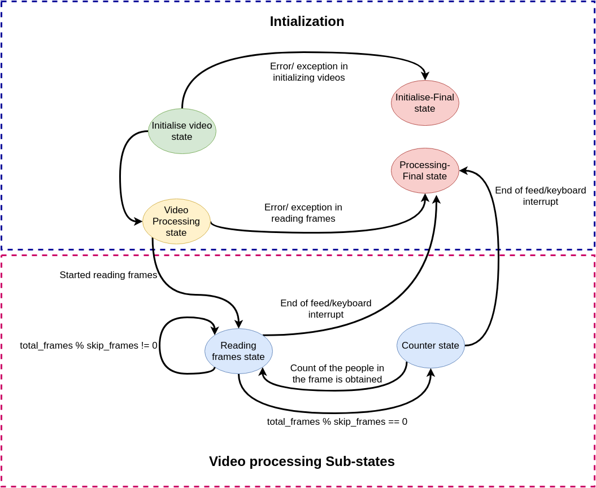

```
```
#
``` peopleCounter_SSDCNet
```
Intro to component here


## Configuration parameters
As any other component,
*peopleCounter_SSDCNet*
needs a configuration file to start. In `etc/config` you can find an example of a configuration file. There are 6 parameters to be initialised:  
1. **save_results:** set this to true if you want the output to be saved on the system
2. **filer:** It should be set to one of three options(None, kf(Kalman filter) or mavg(Moving average). This will vary from video to video.
3. **model:** This should set to one of the three options(model1, model2, model3). This will vary from video to video. They can be downloaded from [here](https://drive.google.com/drive/folders/1i7oVrxz8w4m7t0zQI7-qtv2__M0OSVp3?usp=sharing)). [Note]: download the models to a folder called `model` in the root folder of the component.  
4. **skip_frames:** No. of frames that need to be skipped.
5. **stitch:** Set this to true if there are multiple video feeds and you want the count values to be obtained post stitching the videos together. setting this to false will assume majority voting.
6. **video:** Path/URL of videos. You can set this None if you want to start a webcam stream. 

The state transition diagram of the component:  

    
## Starting the component
To avoid changing the *config* file in the repository, we can copy it to the component's home directory, so changes will remain untouched by future git pulls:

    cd
` <peopleCounter_SSDCNet 's path> `

    `cp etc/config config`
    
After editing the new config file we can run the component:

    `python3 src/python3 src/peopleCounter_SSDCNet.py--Ice.Config=config`
